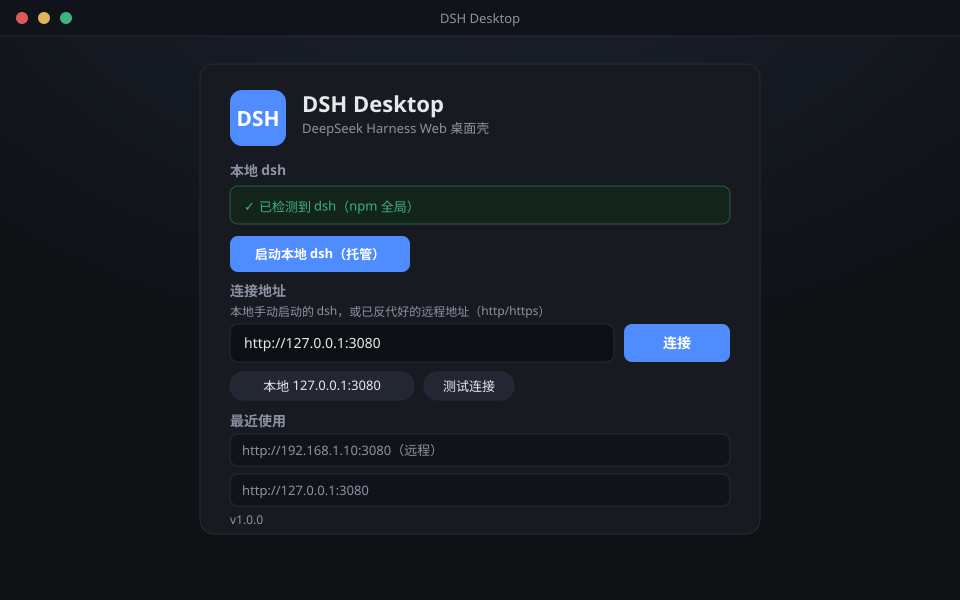
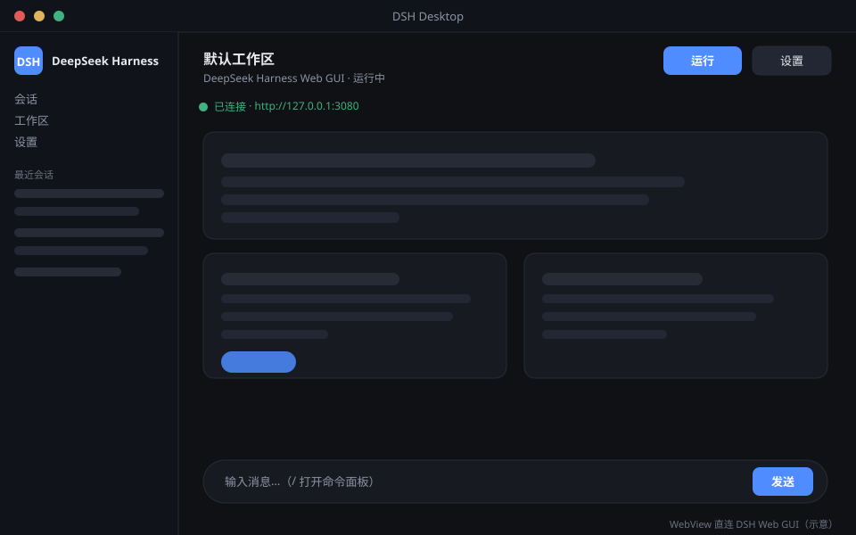

<div align="center">

# 🖥️ DSH Desktop

**DeepSeek Harness Web 的极简桌面壳** — Wails v3 + Go 驱动，WebView 直连 DSH Web GUI

*A thin, no-frills desktop shell that points a WebView at your DeepSeek Harness Web GUI.*

[](https://go.dev)
[](https://v3.wails.io)
[]()
[]()
[]()
[]()
[]()

</div>

> 🪶 **只做壳**：默认不托管 Node / dsh 进程，直接连接你已运行的 dsh（本地或远端反代好的地址）；
> 可选 `--managed` 时由壳托管本地 dsh 的生命周期。**不实现 /api 反代，不改 DSH 前端。**

---

## 📸 截图

| 连接设置页（首次启动 / 无地址时） | 主窗口（WebView 直连 DSH Web GUI） |
| :---: | :---: |
|  |  |

> 上图为示意图，实际界面以运行效果为准。

## ✨ 特性

- **WebView 直连** — 窗口直接加载 DSH Web GUI（http/https，本地或远程地址）
- **内嵌设置页** — 首次启动（或无保存地址）自动打开；输入地址 → 测试连接 → 连接
- **地址持久化** — `data/settings.json` 保存连接 + 最近使用列表（最多 5 条，最新前置）
- **启动自愈** — 启动时探测保存的地址，不可达则自动回退到设置页
- **窗口记忆** — 尺寸自动保存恢复（默认 1360×860，最小 900×600）
- **可选托管模式** `--managed` — 壳启动 / 重启 / 随退随停本地 dsh（`dsh` 命令或 `npx @deepseek-ai/dsh`）
- **系统托盘** — 显示/隐藏、重新加载、连接设置、重启 dsh（仅托管）、状态、打开数据目录、退出；关窗隐藏到托盘
- **数据安全** — settings.json 原子写（tmp + rename），数据目录可整体拷贝实现便携
- **macOS 适配** — 菜单栏模板图标（深浅色自适应）、左键弹原生菜单、ATS 局域网放行

## 🧭 两种连接模式

| | 外部连接（默认） | 托管模式 `--managed` |
| :--- | :--- | :--- |
| **dsh 由谁启动** | 用户自行启动（如 `npx @deepseek-ai/dsh web`） | 壳启动并管理 |
| **dsh 生命周期** | 壳不管理，互不影响 | 随应用退出而停止，托盘可重启 |
| **典型场景** | 本机已跑 dsh / 远端反代地址 | 一键起 dsh，不想碰终端 |
| **启动方式** | `dsh-shell.exe` | `dsh-shell.exe --managed` |

## 🚀 快速开始

首次运行（无保存地址）会自动打开内嵌设置页；也可以直接用命令行：

```text
dsh-shell.exe                                # 直连本机 dsh（地址不可达时打开设置页）
dsh-shell.exe --url http://127.0.0.1:3080    # 指定地址并保存为外部连接
dsh-shell.exe --settings                     # 忽略保存的地址，打开设置页
dsh-shell.exe --reset                        # 清除保存的地址并打开设置页
dsh-shell.exe --managed                      # 托管模式：由壳启动并管理本地 dsh
```

| 参数 | 说明 |
| :--- | :--- |
| `--url <地址>` | 本次启动直接打开该地址并保存为外部连接 |
| `--settings` | 忽略保存的连接，强制打开设置页 |
| `--reset` | 清除保存的连接并打开设置页 |
| `--managed` | 托管模式：随程序启动并管理本地 dsh 进程 |

> **远程地址注意**：DSH 的 `/api` 有浏览器信任围栏，需以 IP 字面量 Host 或
> `--trusted-host` 放行 —— 这是远端 dsh 的配置，本壳不处理。

## 📂 数据目录

| 平台 | 位置 |
| :--- | :--- |
| Windows / Linux | 可执行文件旁的 `data/`（便携，可整体拷贝） |
| macOS | `~/Library/Application Support/app.dsh.desktop` |
| 覆盖 | 环境变量 `DSH_SHELL_DATA_ROOT` |

## 🏗️ 架构

```
main.go                    窗口、启动 URL 决策、命令行参数、尺寸记忆、托盘
assets/                    内嵌设置页（index.html + style.css + app.js，手写零构建）
internal/
  ├── settings/            settings.json 读写（url / recent / window，原子写）
  ├── host/                托管 dsh 子进程（DSH_BIN → npm 全局 → PATH dsh → npx）
  ├── api/                 /__api/* 控制路由（AssetServer Middleware）
  └── tray/                系统托盘（图标 / 菜单 / 状态）
```

- 设置页与 Go 通过 `/__api/*` HTTP 路由通信：`state` / `connect` / `probe` / `version` / `start-managed`
- **安全边界**：窗口跳转到 DSH 地址后，请求直达 DSH 服务器，控制路由不再可达（不暴露给页面与网络）
- URL 校验复用 Wails 的 `application.ValidateAndSanitizeURL`（拒绝 `javascript:` / `data:` / `file:` 等）
- 版本号单一来源：`build/config.yml` 的 `info.version`

## 🔧 构建

> 完整构建文档（环境准备、wails3 CLI 安装、macOS 打包备选方案、FAQ）见 **[BUILD.md](BUILD.md)**

```powershell
# Windows（发布版 + 调试版）
.\build.ps1                      # → bin\dsh-shell.exe（发布，无控制台）
                                 # → bin\dsh-shell-debug.exe（调试，日志写 bin\data\.dsh-shell\）

# 仅调试 / 控制台变体
go build -ldflags "-H windowsgui" -o bin\dsh-shell-debug.exe .
go build -o bin\dsh-shell-console.exe .
```

```bash
# macOS（必须在 Mac 上，Wails v3 走 cgo，无法交叉编译）
wails3 build -clean -platform darwin -skipbindings   # → build/bin/DSH Desktop.app
```

测试 / 静态检查：

```bash
go test ./...
go vet ./...
```

## 🎨 图标与品牌

- 应用图标使用 DSH 官方品牌图标（`dsh-web-frontend/dist/favicon.svg`），由
  `scripts/gen-icon.cjs`（sharp + 手写 ICO 打包）生成多尺寸 `appicon.png` / `icon.ico` / `logo.png`
- macOS 托盘用纯黑 glyph 模板图标（`tray-template.png`），随深浅色菜单栏自适应
- exe 资源（图标 / 清单 / 版本信息）：`build.ps1` 自动执行 `wails3 generate syso`

## 🧩 边界（有意不做）

- **默认不托管 dsh**：外部连接模式下 dsh 由用户自行启动；`--managed` 才接管其生命周期
- **不做 /api 反代与 `__DSH_BOOT__` 注入**（方案 B，后续可选）
- WebView2 加载远程失败时显示浏览器错误页，暂无自定义提示
- 暂无通知 / 深链

## 🙏 致谢

- [DeepSeek Harness](https://github.com/deepseek-ai/deepseek-harness) — 本壳的目标 Web GUI
- [Wails v3](https://v3.wails.io/) — Go 桌面应用框架

## 📄 License

本项目基于 [MIT License](LICENSE) 开源。

Copyright (c) 2025 dsh-shell contributors